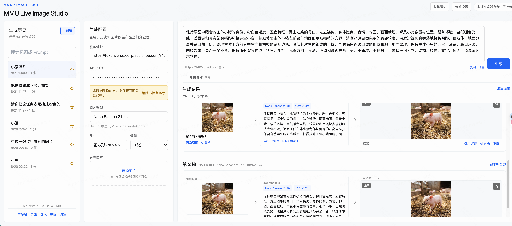

# MMU Live Image Studio

一个面向创作迭代的浏览器端 AI 生图工作台，统一适配 Gemini 图片生成、GPT-Image-2 图片编辑，以及 GPT-5.6 多模态图片分析。



> 本项目的 API Key 由用户在浏览器运行时输入，只保存在当前浏览器中，不写入源码、服务端数据库或日志。

## 案例灵感库

内置「案例灵感」页，基于 [freestylefly/awesome-gpt-image-2](https://github.com/freestylefly/awesome-gpt-image-2) 的 MIT 许可结构化案例索引，提供 523 个可搜索案例：

- 按关键词、分类、风格、场景筛选，并支持浏览器本地收藏；
- 查看大图、完整 Prompt、原案例和原始作者来源；
- 一键将案例 Prompt 带回工作台继续编辑和生成；
- 预览图片从上游公开 GitHub 仓库运行时加载，本站不复制其图片资源；完整许可说明见 [第三方声明](docs/third-party-notices.md)。

## 功能概览

### 图片生成与编辑

- **Gemini 图片生成**
  - `gemini-3-1-flash-lite-image`（Nano Banana 2 Lite）
  - `gemini-3-1-flash-image`（Nano Banana 2）
- **GPT 图片生成与编辑**
  - `gpt-image-2`
  - 无参考图时调用 Images Generations
  - 有参考图时调用 Images Edits
- 支持 1–4 张生成、多尺寸预设与 256–4096px 自定义尺寸。
- Gemini 按图片数量并行请求；GPT 图片接口使用 `n` 参数。
- 支持参考图上传、单图编辑和多图参考融合。
- 支持生成进度、停止生成、多图容错与失败重试。

### 多轮创作链路

- 同一个本地会话可保存多轮生成。
- 任意生成结果可作为下一轮引用图。
- 引用生成轮次以 **引用来源 → Prompt/参数 → 生成结果** 形式展示。
- 引用来源和所有结果图都可以再次引用，方便创建创作分支。
- 支持图片放大、悬停查看生成 Prompt、收藏、选择、对比、保留选中和批量下载。

### AI 图像分析与精修闭环

每张生成图与引用来源图都可打开一个与图片关联的 AI 分析气泡：

- 默认模型：`gpt-5-6-terra`，可切换 `gpt-5-6-sol`、`gpt-5-6-luna`。
- 通过 OpenAI-compatible `chat/completions` 发送图片 Base64 Data URL，支持流式回答。
- 支持快捷分析、自由提问、停止、重试与最多 5 轮追问。
- 分析时自动携带图片所属轮次的原始生成 Prompt，避免建议偏离原始创作目标。
- 快捷分析会要求模型返回：

  ```text
  <analysis>简洁分析结论</analysis>
  <edit_prompt>可直接用于图片编辑的修改 Prompt</edit_prompt>
  ```

- 分析结论与可执行修改 Prompt 严格分离：**分析正文不会直接写入生图 Prompt**。
- 修改 Prompt 可编辑、复制、替换顶部 Prompt，或“一键引用当前图片并使用”。
- 自由问答的回答需要先经过“提炼为修改 Prompt”，才能用于下一轮图片编辑。

### 本地工作台体验

- API Key 仅保存在 `localStorage`，刷新后自动回填，可一键清除。
- 会话、图片和轮次历史保存在浏览器 IndexedDB，默认不自动删除。
- AI 分析会话和自定义模板保存在浏览器 `localStorage`。
- 历史支持搜索、收藏、重命名、导入/导出 JSON 和存储占用估算。
- Prompt 输入框按内容自动扩展高度；支持字符统计、复制、清空与 `Ctrl/Cmd + Enter` 生成。
- 内置灵感模板，同时支持新增、编辑和删除当前浏览器的自定义模板。

## 架构

```text
浏览器
 ├─ 图片生成 / 编辑
 │   ├─ Gemini generateContent
 │   └─ OpenAI Images generations / edits
 ├─ 图像分析
 │   └─ OpenAI-compatible chat/completions（SSE 流式）
 ├─ localStorage
 │   ├─ API Key
 │   ├─ 偏好设置
 │   ├─ 自定义模板
 │   └─ 图像分析记录
 └─ IndexedDB
     └─ 生成会话、轮次与图片
```

应用不使用自建后端存储 API Key、生成图片或分析内容。图片和 API Key 通过浏览器直接请求用户配置的 TokenVerse 地址。

## TokenVerse 配置

### 图片生成服务地址

| 场景 | 地址 |
| --- | --- |
| 办公网 Gemini | `https://tokenverse.corp.kuaishou.com/v1beta` |
| IDC Gemini | `http://tokenverse.internal/v1beta` |
| 办公网 GPT | `https://tokenverse.corp.kuaishou.com/v1` |
| IDC GPT | `http://tokenverse.internal/v1` |

应用会根据选中的模型规范化请求路径：

- Gemini：`/v1beta/models/{model}:generateContent`
- GPT 文生图：`/v1/images/generations`
- GPT 引用编辑：`/v1/images/edits`
- GPT 多模态分析：`/v1/chat/completions`

### API Key

请在页面左侧配置区输入自己的 TokenVerse API Key。请不要将 API Key 写入：

- 源码
- `.env` 以外的任何配置文件
- Git 提交信息
- Issue、截图或日志

## 快速开始

### 环境要求

- Node.js `>= 20`
- pnpm
- 可访问所需的 TokenVerse 服务地址
- 有对应模型权限的 API Key

### 安装与启动

```bash
git clone https://github.com/guanlongbin/mmu-live-image-studio.git
cd mmu-live-image-studio/web/app
pnpm install
pnpm dev
```

### 质量检查

```bash
cd web/app
pnpm typecheck
pnpm lint
pnpm build
```

## 项目结构

```text
mmu-live-image-studio/
├── README.md
├── docs/
│   └── spec.md                    # 产品规格
├── project.md                     # 项目上下文与约束
├── da-app.md                      # 模块清单
└── web/app/
    ├── src/pages/HomePage1.vue    # 主工作台 UI 与交互
    ├── src/services/api.ts        # Gemini / Images / Vision API 协议适配
    ├── src/services/history.ts    # IndexedDB 本地会话存储
    └── package.json
```

## 隐私与安全

### 数据保存位置

| 数据 | 保存位置 | 默认行为 |
| --- | --- | --- |
| API Key | 浏览器 localStorage | 用户输入后自动回填，可手动清除 |
| 生成会话与图片 | 浏览器 IndexedDB | 默认保留，不自动删除 |
| 自定义 Prompt 模板 | 浏览器 localStorage | 默认保留 |
| 图像分析记录 | 浏览器 localStorage | 每张图片保留最近一次分析会话 |
| 上传的临时参考图 | 当前浏览器内存 / 请求体 | 不单独长期保存 |

### 安全边界

- 不读取 Cookie 获取 API Key。
- 不将 API Key 写入仓库。
- 不将用户生成图片、历史会话或分析记录提交到 Git。
- `.gitignore` 已排除环境文件、构建产物、临时文件和 Agent 工作目录。
- 请在推送代码前再次使用密钥扫描工具检查提交内容。

## GitHub 说明

当前代码由快手内部 Web 应用脚手架构建，`package.json` 包含部分公司内部工作区依赖，例如 `@ks-data/*`。因此：

- 源码可以公开阅读、审查和二次开发。
- 在公司外部环境直接执行 `pnpm install` 可能因无法访问内部 npm registry 或工作区依赖而失败。
- 若希望将项目改造成可在公开互联网独立运行的版本，需要将内部依赖替换为公开 npm 包，并补充独立构建/部署配置。

## 常见问题

### 为什么生成失败？

请依次确认：

1. API Key 是否具有相应模型权限。
2. 办公网 / IDC 服务地址是否匹配当前网络环境。
3. Gemini 与 GPT 模型是否使用了正确的服务端版本路径。
4. GPT-Image-2 编辑时参考图是否为浏览器可读取的有效图片。
5. 浏览器 Network 面板中服务端返回的具体错误信息。

### 为什么 AI 分析不能直接追加到 Prompt？

分析报告包含判断过程、正常项和背景说明，并不是适合图片模型执行的指令。应用会把分析与 `<edit_prompt>` 分开，只允许独立的、可编辑的修改 Prompt 用于下一轮创作。

### 为什么 GitHub 中没有我的图片或历史记录？

它们只保存在你的浏览器 IndexedDB / localStorage，本项目不会将其写入 Git 仓库。

## 许可证

当前仓库暂未指定开源许可证。请在公开发布或接受外部贡献前，根据你的使用范围补充合适的 `LICENSE` 文件。
